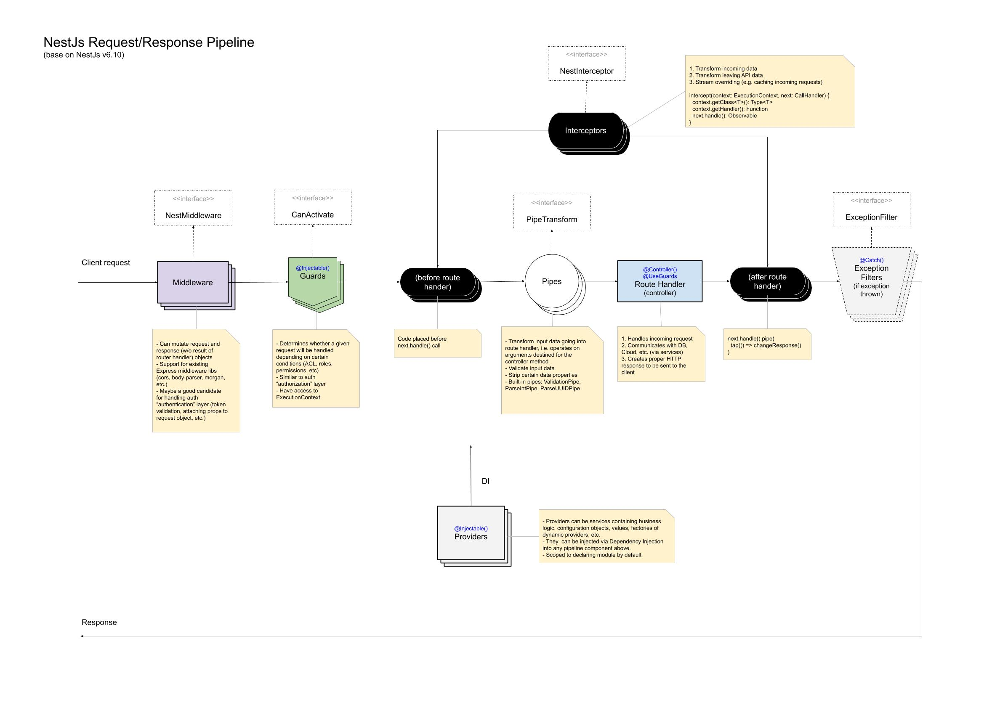

# Nestjs



- Modules --> Groups together code
- Pipe --> Validate data in the request
- Filters --> Handles errors during request handling
- Guard --> Check user authentication
- Controller --> Route request to function
- Service --> Run business logic
- Interceptors --> Adds extra logic to incoming requests and outgoing responses
- Repository --> access database

## Validation

- create a validation class

`create-messages.dto.ts`

```ts
import { IsString } from "class-validator";

export class CreateMessageDto {
  @IsString()
  content: string;
}
```

- add validation pipe to main

`main.ts`

```ts
import { ValidationPipe } from "@nestjs/common";
import { NestFactory } from "@nestjs/core";
import { MessagesModule } from "./messages/messages.module";

async function bootstrap() {
  const app = await NestFactory.create(MessagesModule);
  app.useGlobalPipes(new ValidationPipe());
  await app.listen(3000);
}
bootstrap();
```

- add validation class as type to body of request

`messages.controller.ts`

```ts
import { Controller, Get, Post, Body, Param } from "@nestjs/common";
import { CreateMessageDto } from "./dtos/create-messages.dto";

@Controller("messages")
export class MessagesController {
  @Get()
  listMessages() {
    return "get 1";
  }

  @Post()
  postMessage(@Body() body: CreateMessageDto) {
    return body;
  }

  @Get("/:id")
  getMessage(@Param("id") id: string) {
    return id;
  }
}
```

## Interceptors
